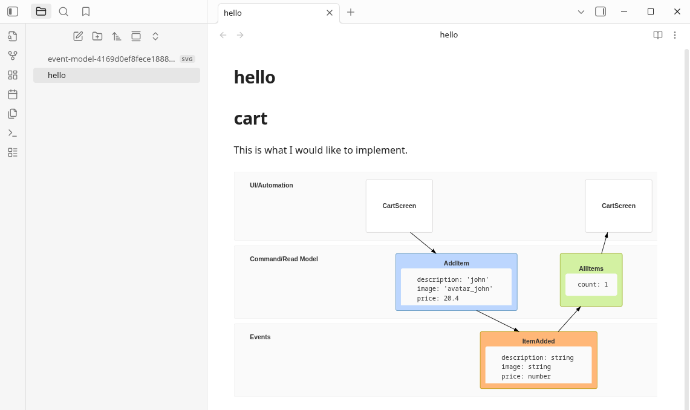
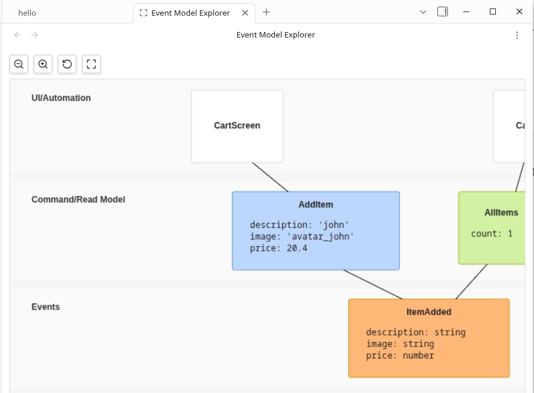
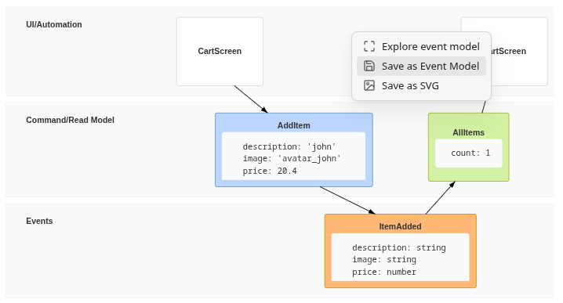

# Event Modeling Obsidian Plugin

The project contains a [plugin for Obsidian](https://obsidian.md/) for viewing Event Models represented as text DSL.

You can edit the DSL in any text editor or use [VS Code Extension](https://github.com/lgazo/event-modeling-tools/tree/main/packages/vscode-extension).

## Features

### Render

Render Event Model diagram. Create a markdown file and put a code block following the [DSL Language](https://github.com/lgazo/event-modeling-tools/tree/main/packages/language).

You can find example [vault here](https://github.com/lgazo/event-modeling-tools/tree/main/packages/obsidian-plugin/test/test-vault).

### Explore

Explore Event Model diagram, zoom in and out, pan. Right-click the diagram and Explore.

### Save

Save text DSL and SVG as well. Just right-click the diagram and select suitable format.

## Installing

This plugin aspires to be available directly from within the app. The plugin will be found in the Community Plugins directory which can be accessed from the Settings pane under Third Party Plugins.

## Manual installation

1. Build the project following the instructions in [development doc](./DEVELOPMENT.md) 
1. Extract the content of folder `out` to your vault's plugins folder: `<vault>/.obsidian/plugins/event-modeling-obsidian-plugin`  
Note: On some machines the `.obsidian` folder may be hidden. On MacOS you should be able to press `Command+Shift+Dot` to show the folder in Finder.
1. Reload Obsidian
1. If prompted about Safe Mode, you can disable safe mode and enable the plugin.
